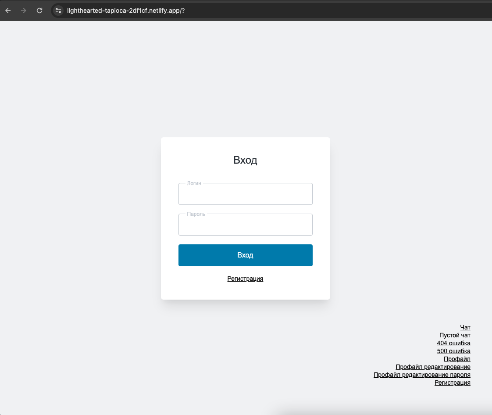

## Описание
Удобный чат для общения

## Макет:
https://www.figma.com/file/qKBYzE896prY68MVFeOcOS/Chat?type=design&node-id=1%3A787&mode=design&t=WyQJeJ4vtSi9DZpN-1

## Pull-request
https://github.com/Valkyrie22fi/middle.messenger.praktikum.yandex/pull/4

## Установка
- `npm install` — установка стабильной версии,
- `npm run dev` — запуск версии для разработчика,
- `npm run start` - сборка и запуск проекта,
- `npm run build` — сборка стабильной версии.

## Netlify.app

[Netlify.app](https://lighthearted-tapioca-2df1cf.netlify.app/)

## Страницы
ссылки на все страницы в правои нижнем углу

